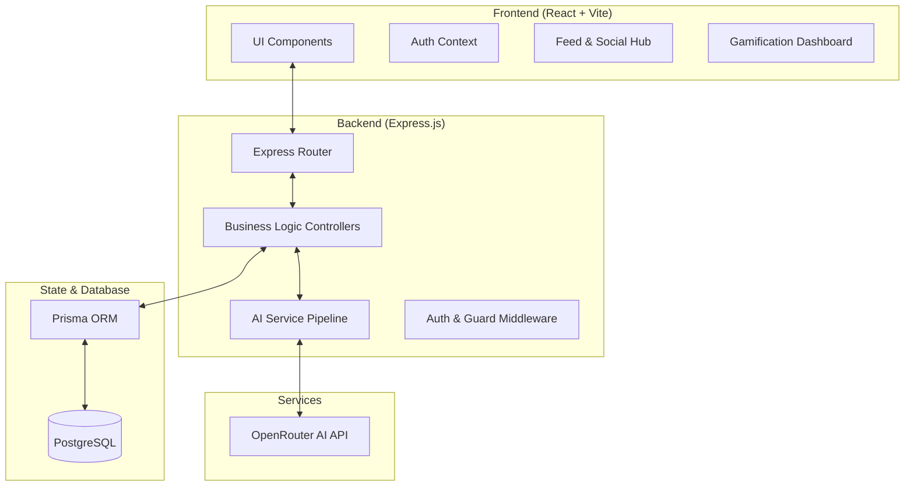

# DoubtFlow System Architecture & Design

## 🚀 Overview
DoubtFlow is a gamified, AI-powered learning platform designed for students to share notes, ask doubts, and build a consistent learning habit through streaks and coin rewards.

---

## 🏗️ High-Level Architecture
The system follows a classic **Full-Stack MERN-style architecture** but utilizes a modern PostgreSQL + Prisma stack for the data layer and integrates a robust AI retry-pipeline.

---

## 🛠️ Tech Stack & Rationales

### Frontend
- **React 19 & Vite**: High-performance rendering and incredibly fast development feedback loops.
- **Tailwind CSS v4**: Utility-first styling for a premium, custom UI without the bloat of traditional component libraries.
- **Lucide React**: Consistent, high-quality iconography for a professional aesthetic.
- **React Hot Toast**: Instant, interruptive feedback for the gamification mechanics.

### Backend
- **Express.js**: Lightweight and flexible standard for Node.js REST APIs.
- **Prisma ORM**: Type-safe database access with automated migrations and powerful aggregations (used for upvote/comment counts).
- **PostgreSQL**: Reliable, ACID-compliant relational database for complex user-interaction data.

---

## 🧠 AI Pipeline Design (Retry-Strategy)
To handle the high rate-limiting of free-tier AI models, DoubtFlow implements a **Sequential Fallback Strategy**.

1. **Attempt 1**: `google/gemma-4-31b-it:free` (High reasoning, first choice).
2. **Attempt 2 (Fallback)**: `minimax/minimax-m2.5:free` (Fast, secondary choice).
3. **Attempt 3 (Final)**: `nvidia/nemotron-nano-9b-v2:free` (Highly stable).

This ensures that user requests (Hints, Quizzes, Tags) almost never fail due to API saturation.

---

## 🎮 Gamification Mechanics
System logic triggers that reward positive behavior:
- **Solve a Doubt**: Mark a comment as correct to award the contributor 20 coins.
- **AI Tool Usage**: Spending 5-10 coins for specialized AI hints/quizzes encourages strategic resource management.
- **Streak Tracking**: Continuous daily activity tracks user consistency, visualized in global rankings.

---

## 🔒 Security & Performance
- **JWT Authentication**: Stateless, secure sessions with `httpOnly` headers.
- **Database Indexing**: Prisma-backed unique constraints on `Upvotes` (userId + postId) ensure data integrity and query speed.
- **Cascading Deletes**: Robust cleanup logic ensures that deleting a post automatically scrubs associated upvotes and comments.
